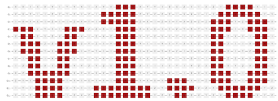

# Qiskit Gate Art



## Setup
Clone
```
git clone https://github.com/davidwrenner/Qiskit-Gate-Art.git
```
(optional) Create & ActivateVirtual Environment
```
virtualenv env

source env/bin/activate
```
Install Requirements
```
pip install -r requirements.txt
```
Usage
```
./qiskit_bitmap.py text_string
```

